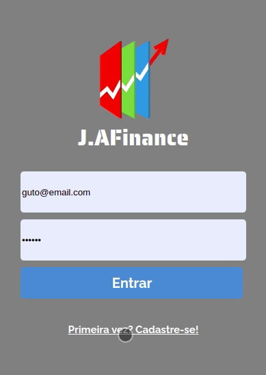

# J.AFinance

Este projeto é autoral e foi desenvolvido, para solucionar a o problema que pequenos empresários tem para fazer o controle financeiro de suas construtoras



Você pode acessar por aqui https://j-afinance.vercel.app/

## Sobre

Nesta Aplicação, você concegue fazer de A-Z , desde monitorar seus gastos categorizados por materiais, despezas, e mão de obra. Como inserir empreitas, inserir seus fechamentos semanais, junto com os pagamentos, e os dados dos seus funcionarios. Alem de vizualizar tudo isso em um gráfico. Este projeto ainda esta em andamentos, os proximos passos será alem de inserir e vizuzalizar tudo, poder excluir e fazer update, para assim a plicação poder ficar completa.Ate agora as features que estao no ar são:

- Cadastro
- login
- inserir e vizualizar as suas obras
- inserir , vizualizar e atualizar os dados dos seus funcionarios
- inserir e vizualizar as suas entradas de cada obra
- inserir e vizualizar as suas despezas de cada obra
- inserir e vizualizar os gastos com materiais
- inserir e vizualizar os seus fechamentos de gastos com mao de obra(semanal ou quinzenal)
- inserir e vizualizar os seus pagamentos realizados em cada fechamentos
- vizualizar o dashboard de cada obra

## Technologies
As ferramentas e frameworks utilizados para a construção desse projeto:<br>
<p>

  
  
  
  
  
  
  
  
  
  
  
  
  
  
  
   
</p>

## How to run

1. Clone este repositório
2. Clone o repositório do back-end  https://github.com/kethllen/J.AFinance-api
3. FSiga as instruções para executar o back-end  https://github.com/kethllen/J.AFinance-api
4. Instale as dependencias do front-end
```bash
npm i
```
5.Crie um arquivo de variáveis de ambiente na raiz do projeto (.env) e configure uma variável com o nome 'REACT_APP_BACK_URL' que contenha a url onde o back-end estará rodando, Exemplo:
```bash
http:localhost:5000/
```
5. Execute o front-end:
```bash
npm start
```
6. Por fim, acesse http://localhost:3000 em seu navegador favorito.
